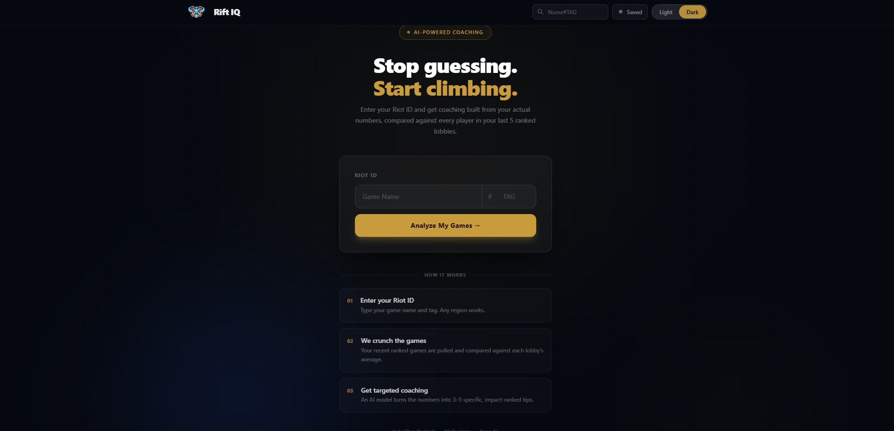

# Rift IQ

AI-powered League of Legends coaching. Enter your Riot ID, get a breakdown of your last 10 ranked games, and receive targeted tips generated by an LLM grounded in your actual stats vs. lobby averages.


---
## Screenshots


## What it does

Most coaching tools give you raw stats and leave the interpretation to you. Rift IQ compares your performance **against the other 9 players in each of your games**, identifies where you're falling behind, and generates **3-4 specific, actionable coaching tips** ranked by impact.

**Key features:**

- **Ranked game analysis** - pulls your last 10 solo/duo games via the Riot API
- **Lobby-relative stats** - compares your KDA, CS/min, vision score, damage, gold, and more against per-game averages (not global averages)
- **AI coaching tips** - LLaMA 3.3 70B (via Groq) generates tips grouped by Vision, Combat, and Economy. Talks to you directly, no generic advice
- **Per-game performance score** - 0-100 score for each game based on your rank within the 10-player lobby
- **Lane diff badge** - shows which lane had the biggest score gap in each game, and which lane was most consistently diffed across your recent games
- **LP trend graph** - estimates LP gain/loss across your recent games
- **Expandable scoreboards** - full 10-player scoreboard with performance scores for every game
- **Paginated match history** - loads 10 games by default, expand up to 40 with "Load more"
- **AI chat** - ask follow-up questions about your gameplay, scrollable inline chat panel
- **Refresh button** - re-fetch profile and analysis without navigating away
- **Save profiles** - star up to 10 profiles for quick access from the navbar
- **Dark/light mode** - League-themed UI

---

## Tech stack

| Layer | Tech |
|---|---|
| Frontend | React 19, Vite, Tailwind CSS, React Router |
| Backend | FastAPI, Uvicorn, httpx (async) |
| AI | Groq API - LLaMA 3.3 70B |
| Data | Riot Games API |

---

## Getting started

You'll need a [Riot API key](https://developer.riotgames.com/) and a [Groq API key](https://console.groq.com/).

### Backend

The backend is structured modularly for scalability:
- `app/main.py`: Application entry point and middleware configuration.
- `app/routes/api.py`: API route handlers for Riot and Groq integrations.
- `app/services/`: Core logic for Riot API (`riot.py`) and Groq AI (`groq.py`).
- `app/models/`: Pydantic models for request/response validation.
- `app/state.py`: Global state, caching, and environment configuration.

```bash
cd backend
pip install -r requirements.txt
cp .env.example .env   # add your API keys
uvicorn main:app --reload
```

### Frontend

```bash
cd frontend
npm install
npm run dev
```

Open `http://localhost:5173`, enter a Riot ID (e.g. `Faker#KR1`), and hit Analyze.

---

## Environment variables

```env
RIOT_API_KEY=your_riot_api_key
GROQ_API_KEY=your_groq_api_key
RIOT_REGION=na1          # your server region (na1, euw1, kr, etc.)
RIOT_ROUTING=americas    # routing region (americas, europe, asia)
```

---

## API endpoints

| Method | Path | Description |
|---|---|---|
| `GET` | `/summoner/{game_name}/{tag_line}` | Resolve Riot ID to PUUID |
| `GET` | `/profile/{puuid}` | Rank, LP, W/L, summoner level |
| `GET` | `/analyze/{puuid}?game_name={name}` | Full analysis: stats, AI coaching, per-game scores, lane diff |
| `GET` | `/history/{puuid}?start={n}&count={n}` | Load additional match pages (no AI re-run) |
| `GET` | `/match/{match_id}/scoreboard` | 10-player scoreboard with performance scores |
| `POST` | `/ask` | Follow-up chat with the AI coach |

---

## How the coaching works

The `/analyze` endpoint:

1. Fetches your last 10 ranked match IDs
2. Pulls full match data for each game in parallel
3. Extracts your stats and the lobby average across 9 key metrics
4. Computes a per-game performance score (0-100) by ranking you within the 10-player lobby
5. Identifies the "diffed lane" per game (biggest score gap between opposing players in the same role)
6. Builds a structured prompt with per-game deltas (you vs. average)
7. Calls Groq's LLaMA 3.3 70B with a strict system prompt that enforces actionable, grouped tips in second person
8. Returns stats, game history, coaching narrative, scores, and lane diff data in one response

The AI talks directly to you and references your actual numbers.
